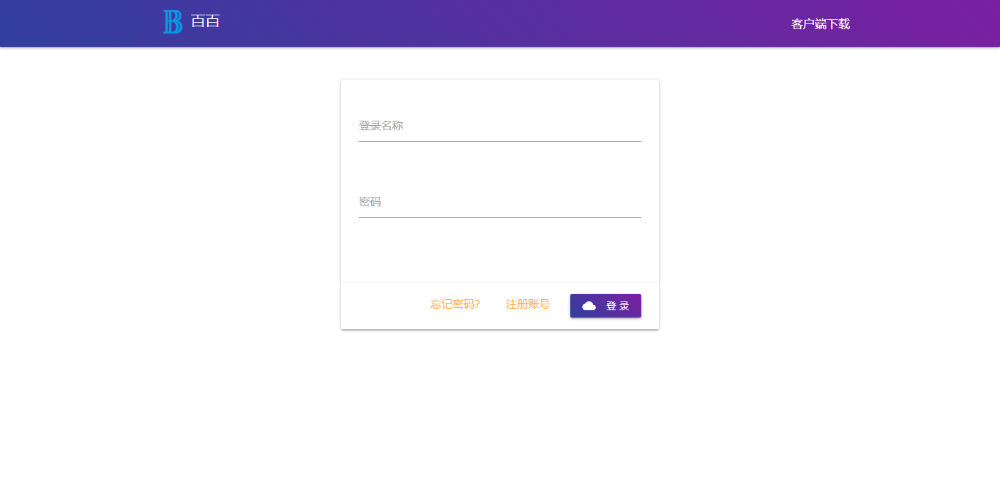
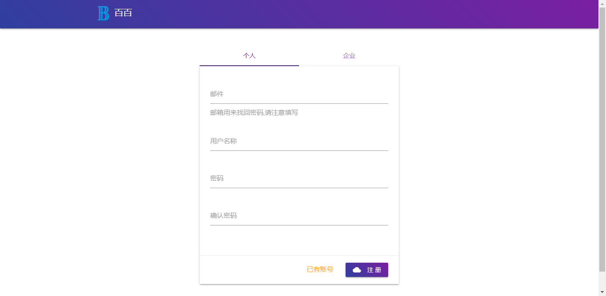
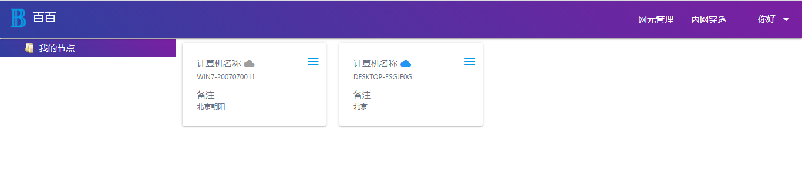
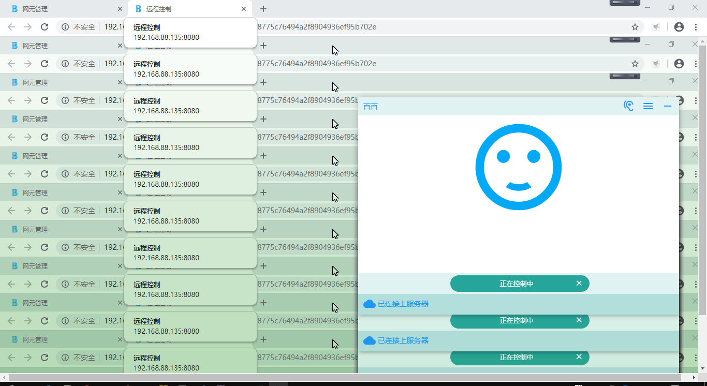
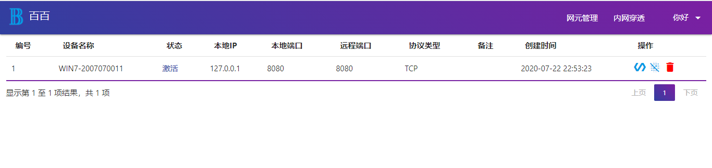
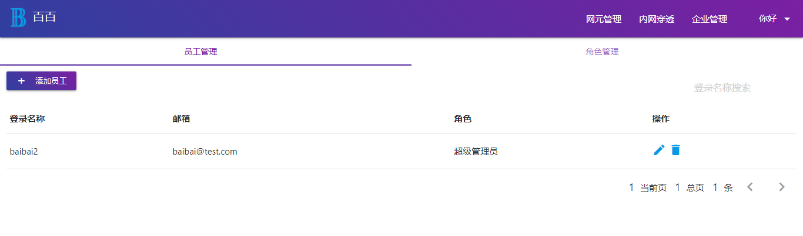

# 百百-远程控制

基于web的远程控制，无任何插件。协议支持vnc，rdp，ssh。

支持内外穿透、四层协议代理。

配合[客户端](https://github.com/baibaicloud/prober)使用即使被控PC没有公网也能进行远程控制,随时随地进行远程控制，还可支持代理局域网端口。

支持个人、企业、权限控制。

# 系统整体技术栈
java-jdk1.8

平台-spring boot+html+css+jquery

客户端-electron

远程控制-vnc ultra

内网穿透-frp-有进行增强，主要增加端口验证，预防恶意连接、代理。[frp源码](https://github.com/baibaicloud/frp)

数据库-mysql

平台程序支持运行在linux,windowns

客户端目前只支持windowns7/10 32/64位

# 百百系统界面
### 登录


### 注册界面


### 网元管理


### 网元菜单


### 控制


### 内网穿透


### 企业管理


# 一键部署百百系统
[请查看./deployment/readme.md](./deployment/readme.md)

# 平台源码启动
修改配置文件

```
/assembly/src/main/resources/application.properties
```

主要修改数据库地址

启动类设置为`com.loon.bridge.LauncherApplication`即可。

系统默认启动会监听`8080`端口

# 客户端源码启动
[客户端源码](https://github.com/baibaicloud/prober)

直接进入prober根目录

```powershell
npm start
```

启动之后要修改平台服务器地址

# docker build image
```
docker build -t registry.cn-hangzhou.aliyuncs.com/baibaicloud/baibai-platform:1.0.0 .
```